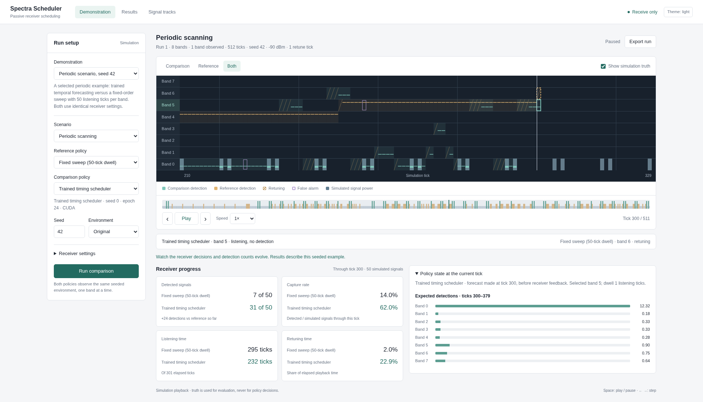

# Spectra Scheduler — Predictive Frequency-Time Allocation

[](https://github.com/Siwach777/spectra-scheduler/actions/workflows/ci.yml)

A passive, receive-only spectrum scheduling prototype for **SIH26055 — Smart Scan
Strategy for Electronic Warfare**. A receiver observes only part of the spectrum
at a time. Spectra Scheduler learns temporal opportunities from its own detections
and chooses **which band to visit and how long to listen**, accounting for time
lost while retuning.

The selected system combines a **causal temporal forecaster** with a
**retune-aware receding-horizon planner**. It includes a receiver simulator,
external pulse-data replay, matched policy benchmarks, a browser demonstration,
CLI tools and versioned metric reports. [Project scope](docs/project_scope.md)
defines the requirements.

| Measured result | Evaluation setting |
| --- | --- |
| **67.66% periodic capture** versus 10.87% for fixed sweep | Frozen comparison on 100 fresh periodic worlds, within a 300-world synthetic benchmark |
| **43.49% external replay capture** versus 10.45% for fixed sweep; **4.16×** ratio of means | 32 unseen synthetic TSRD validation recordings, identical 10-second receiver budgets |
| **0.464–0.532 ms warmed serial p99** with native planning and CUDA graph inference | Full scheduler computation on the RTX 5070 Laptop GPU; cold startup and receiver I/O excluded |

Capture, discovery and prediction quality are reported separately. The model still
trails a stronger RateProbe control in external replay capture, and its spatial
emitter discovery trails fixed sweep. These are synthetic evaluation results,
not real RF or hardware validation.

[Quick start](#quick-start) · [How it works](#how-the-scheduler-works) ·
[Architecture](#system-architecture) · [Demo](#browser-demo-and-http-api) ·
[CLI](#command-line-workflows) · [Results](#measured-results) ·
[Training](#training-and-checkpoint-selection) · [Project map](#repository-map)

## The scheduling problem

A fixed sweep revisits each band on a predetermined schedule. Brief transmissions
can occur between visits, and periodic emitters can repeatedly fall outside its
listening windows. Retuning also consumes time during which the receiver cannot
collect detections.

The action is a joint frequency-time decision:

$$
a_t = (b_t, d_t),
$$

where $b_t$ is the next band and $d_t$ is the requested **listening dwell after
retuning**. The selected eight-band experiments use 1, 10 and 50-ms dwells, giving
24 actions. Changing bands adds the public receiver's retune delay to elapsed time;
staying on a band does not pay it again. These are experimental settings, not a
hardware specification.

The receiver has censored observations: a band it did not listen to is **unknown**,
not empty. The scheduler must balance exploiting predicted activity with revisiting
bands for discovery. It receives no emitter identities, actual emitter periods or
phases, scenario labels, or future transmissions. Offline training learns generic
timing patterns; deployment decisions use the observations accumulated in the
current episode and public receiver settings.

## What is implemented

| Component | What it does | Status |
| --- | --- | --- |
| Passive receiver simulation | Models agile, spatially scanning and periodic emitters, sensitivity, noisy measurements, missed detections, false alarms and retuning | Implemented and tested |
| Causal timing forecaster | Uses listening masks, counts and available measured power to forecast opportunities across bands | Selected learned component |
| Frequency-time planner | Integrates predicted capture over the forecast horizon, charges retune time and executes native band/dwell actions | Selected scheduler; age-based coverage probes enabled |
| Browser demonstration | Compares two schedulers on the same world with receiver paths, detections, causal forecasts, playback metrics and JSON export | Implemented for synthetic worlds |
| Synthetic CLI | Runs seeded policy comparisons, adds local timing/MPC checkpoints, and exports JSON or CSV | Implemented |
| Physical-time PDW replay | Streams full-spectrum stare recordings and executes band/dwell actions with explicit pulse-boundary rules | Implemented; frozen timing transfer validated |
| Strong controls | Fixed sweeps, phase planning, UCB, sliding UCB, Bayesian occupancy, Thompson sampling, Whittle and golden sweep | Compared under the shared receiver contract |
| CUDA training and reporting | Collects bounded causal histories, trains and selects checkpoints on separate data, freezes reporting choices | Implemented experiment pipelines |
| Runtime acceleration | Optional C++ planning and captured CUDA launches, with report-parity checks and serial latency measurements | Implemented; opt-in |
| Dataset ingestion and association | Validates streamed HDF5 data and evaluates bounded offline HDBSCAN samples | Implemented; separate from the timing scheduler |
| Other learning branches | Supervised hit prediction, DQN, recurrent PPO, trajectory RL and Neural-MPC | Implemented research/comparison branches; not the selected scheduler |

PDW fine-tuning and additional acquisition/coverage rules are also implemented,
but their held-out results did not justify replacing the selected policy. Detailed
capability boundaries are in [project status](docs/project-status.md).

### Terms used in this repository

| Term | Meaning here |
| --- | --- |
| PDW | Pulse descriptor word: a pulse's arrival time, frequency, width, angle and amplitude |
| TCN | Temporal convolutional network: the causal encoder inside the selected timing forecaster |
| Receding-horizon planning | Plan several future actions, execute the first, observe feedback and plan again |
| UCB / Thompson sampling | Observation-driven exploration controls used as adaptive baselines |
| Whittle | Belief/index scheduling controls; their implemented variants are benchmark competitors |
| Neural-MPC | Separate learned model predictive control branches using latent dynamics and tree search |
| DQN / PPO | Deep Q-network / proximal policy optimization; direct-action RL comparison branches |
| RLOO | REINFORCE leave-one-out optimization, used in an experimental trajectory policy; no LLM runs in the scheduler |

The selected planner also uses receding-horizon control, but it does not load the
separate Neural-MPC latent-model checkpoints. The forecaster supplies timing
intelligence; the planner turns it into feasible receiver actions.

## Quick start

### 1. Install the project

The project targets **Python 3.12** and uses `uv` for the locked CPU development
environment. From a new checkout:

```bash
git clone https://github.com/Siwach777/spectra-scheduler.git
cd spectra-scheduler
uv sync --locked --extra dataset --extra learning --extra dev
```

The core simulator requires NumPy. The extras add HDF5 ingestion, offline learning
and development checks. CPU statistical demonstrations need neither a dataset nor
model weights.

### 2. Run a comparison without CUDA or weights

```bash
.venv/bin/python -m spectra_scheduler \
  --scenario periodic-scan --runs 30 --seed 7 --workers 4 \
  --output reports/generated/periodic-controls.json
```

The terminal prints scheduler outcomes; the report stores the configuration,
per-run results and summaries. Replace `.json` with `.csv` for a spreadsheet report.
The installed `.venv/bin/spectra-scheduler` command is equivalent to
`.venv/bin/python -m spectra_scheduler`.

This statistical comparison includes a legacy one-tick `round-robin` policy, which
can spend nearly all its time retuning. The headline results and video instead use
a fixed sweep with **50 ms of listening per band**. The trained timing comparison
below includes full-listening dwell controls explicitly.

Start a statistical browser demonstration:

```bash
.venv/bin/python web/server.py
```

Open `http://127.0.0.1:8080`. Learned policies are marked unavailable when their
compatible weights or CUDA are missing; another policy is not substituted silently.

### 3. Set up CUDA for the trained model

Neural training and experimental neural evaluation require CUDA. CPU unit checks
are separate. The tested development setup uses PyTorch 2.7.1 with CUDA 12.8 in
its own environment:

```bash
uv venv .venv-rl --python 3.12
uv pip install --python .venv-rl/bin/python torch==2.7.1 \
  --index-url https://download.pytorch.org/whl/cu128
uv pip install --python .venv-rl/bin/python -e '.[dataset,learning,dev]'
```

The selected local checkpoint is:

```text
artifacts/timing-refine-v1/seed-0/best.pt
Selected epoch: 24
SHA-256: f821a7672b5b378154caa89d981893b77a62ddc0119ea74053483aa611ca744f
```

**Weights, recordings and training caches are not shipped in Git.** An existing
installation needs these local artifacts to reproduce the selected model. A fresh
checkout can run statistical controls immediately or use the training pipeline
below to create its own checkpoints. The published summaries remain readable
without any artifacts. Setup details are in the [runbook](docs/runbook.md#1-set-up-the-environment).

## System architecture


The CLI and browser are independent entry points to the Python core. Two receiver
backends feed the same timing-policy logic: discrete synthetic worlds and streamed
PDW replay. Receiver observations enter bounded causal memory, the forecaster
estimates future opportunities, and the planner returns band/dwell actions to the
receiver. Training creates frozen checkpoints offline. Hidden truth and labels
reach the evaluator or training-target collector, never the runtime policy.

The [architecture guide](docs/architecture.md) documents component interfaces and
module ownership. Both the [system diagram](docs/assets/architecture.svg) and
[model diagram](docs/assets/timing-model.svg) are editable SVGs with selectable text.

## How the scheduler works

### 1. Record what the receiver actually observed

`TimingHistory` retains the preceding **288 one-millisecond ticks** for each band.
Its three channels contain a listening mask, observed detection counts and
normalized measured power when available. Retuning ticks have no listening
exposure. A zero count is evidence of a miss only when the listening mask is set.
Separate causal state tracks the current band and observation ages for coverage.

Synthetic observations expose anonymous, noisy receiver measurements. Replay
observations expose delivered PDWs and the executed listening window. The replay
adapter bins their actual timestamps into millisecond history, retains raw pulse
counts and explicitly disables the calibrated-power gate when power is unavailable.
TSRD amplitude is in dataset dB and is not converted into receiver dBm.

### 2. Infer temporal opportunities


The selected `TimingBeliefNetwork` combines a band-shared temporal convolutional
network (TCN) with learned weights over periodic phase hypotheses and an aperiodic
rate estimate. Left-padded convolutions use only past observations. The network
uses observed exposure, hits and contextual evidence to weight possible timing
structure and correct the estimated rate.

The **2–144-ms periods are hypotheses**, not emitter parameters supplied by the
simulator. Every band shares the model parameters and has no absolute band-ID
embedding. The output contains expected capture counts for the next **80 ms**
across all bands. It is a forecast inferred from censored observations, not access
to the future truth grid.

### 3. Plan across frequency and time

`CalibratedTimingPlannerPolicy` runs a finite-horizon dynamic program over those
forecasts, the current band, retune delays and available dwell choices. It maximizes
integrated predicted capture within the remaining horizon, executes the first
action, consumes new observations and replans.

The selected policy also checks band staleness: its saved settings use a 512-ms
revisit threshold and a 10-ms coverage probe. Coverage uses observed listening
history. It does not guarantee discovery of every brief or previously unseen
signal. The current acquisition experiments remain outside CLI/GUI defaults.

### 4. Forecast and measure the chosen action

The synthetic timing policy submits capture probability, intercept-delay and
interception-ratio predictions **before** the action executes. The evaluator then
compares them with the receiver's actual outcomes. Ratio calibration uses the
public detection probability and assumes above-sensitivity arrivals; unseen weak
signals are not inferred from hidden truth.

The PDW adapter currently supplies band/dwell decisions; calibrated external
intercept-time forecasts are not established. Replay reports preserve unavailable
prediction metrics rather than inventing values. Model weights remain frozen
throughout inference; updating history is not online weight retraining.

## Browser demo and HTTP API

Run the selected timing model:

```bash
.venv-rl/bin/python web/server.py \
  --timing-model artifacts/timing-refine-v1/seed-0/best.pt
```

Open `http://127.0.0.1:8080/?preset=periodic-timing-video&view=dual`.
Use `--port 8081` if the default port is occupied. No frontend build is required.



The interface shows the spectrum and simulated activity, each receiver's current
listening window, historical detections, pre-action opportunity forecasts,
selected band/dwell and capture/discovery counters. Choose a preset or scenario,
run the comparison, play or scrub its timeline, and export the complete run as
JSON. The comparison is computed before playback; counters follow the selected
timeline position. Simulation truth can be hidden and is never a policy input.

The video preset uses **periodic-scan, raw seed 42, 512 ticks**. The selected timing
model captures **62/86 signals versus 13/86** for the 50-ms fixed sweep, with 100%
emitter discovery for both. Its **4.77×** ratio describes that selected example,
not all scenarios or the aggregate benchmark.

The local HTTP API provides:

| Request | Purpose |
| --- | --- |
| `GET /api/scenarios` | Available scenarios and receiver defaults |
| `GET /api/schedulers` | Policy availability and model provenance |
| `GET /api/presets` | Named comparison configurations |
| `POST /api/run` | A complete matched comparison with traces, forecasts, metrics and deltas |
| `GET /api/reports` | Available local report names and sizes |
| `GET /api/report/<name>` | One report from the configured report directory |

Example request to a running server:

```bash
curl -sS http://127.0.0.1:8080/api/run \
  -H 'Content-Type: application/json' \
  -d '{"scenario":"periodic-scan","baseline":"dwell-sweep-50","active":"timing-trained","seed":42}'
```

The browser currently supports synthetic comparisons. Recordings run through the
replay CLI/Python interface. API options, receiver controls, error responses and
export fields are documented in [web/README.md](web/README.md); video setup is in
[web/video/README.md](web/video/README.md).

## Command-line workflows

### Synthetic worlds and custom scenarios

| Scenario | What it exercises |
| --- | --- |
| `frequency-agile` | Frequency hopping across bands |
| `spatial-scan` | Intermittent visibility of scanning fixed-frequency emitters |
| `periodic-scan` | Repeating short observation opportunities |
| `mixed` | Multiple behaviors and receiver imperfections |
| `acquisition` | Discovery of previously unknown emitters |
| `tracking` | Following a moving signal |
| `change` | Responding to a mode change |
| `crowded` | Ambiguous measurements and track association |

Inspect all arguments with `.venv/bin/python -m spectra_scheduler --help`.
Custom worlds use the validated [scenario JSON format](docs/scenario-format.md):

```bash
.venv/bin/python -m spectra_scheduler \
  --scenario-file examples/custom-scenario.json --runs 30 --workers 4 \
  --output reports/generated/custom.json
```

Use either `--scenario` or `--scenario-file`. Add `--association` to statistical
comparisons for track-association metrics.

### Compare the trained timing policy

```bash
.venv-rl/bin/python -m spectra_scheduler \
  --timing-model artifacts/timing-refine-v1/seed-0/best.pt \
  --scenario periodic-scan --runs 100 --seed 48000 --workers 20 \
  --inference-batch-size 20 \
  --output reports/generated/timing-periodic.json
```

This includes existing statistical policies, full-listening round-robin dwell
controls and a non-neural phase predictor with the same planner. Capture and
discovery are printed together; JSON also contains forecasts and paired intervals.
Named scenarios use a hashed reporting seed namespace. Their CLI seed is not the
raw scenario-builder seed used by the browser, so CLI seed 42 does not reproduce
the GUI's seed-42 video example.

When compatible physical MPC artifacts exist, add either or both:

```text
--mpc-model artifacts/mpc-physical-fresh-control/best.pt
--mpc-model artifacts/mpc-physical-gumbel-fresh/best.pt
```

Saved MPC comparisons require a named eight-band requirement scenario:
`frequency-agile`, `spatial-scan` or `periodic-scan`. GPU inference batching and CPU
workers are separate controls; neither is the optimizer minibatch size. The
[frozen scan study](docs/runbook.md#3-run-simulator-comparisons) selects the larger
control-family comparison on separate worlds before reporting. A single CLI run
is not a replacement for that selection/reporting protocol.

### Replay external pulse recordings

TSRD provides synthetic pulse descriptor words (PDWs): arrival time, frequency,
pulse width, angle of arrival and amplitude. **Stare** recordings observe the full
spectrum and permit counterfactual receiver scheduling. **Scan** recordings are
already censored by the recorded scan; missing bands cannot be reconstructed as
negative observations.

Download/resume the current scan/stare splits using the supplied script after
obtaining dataset access and authenticating interactively:

```bash
uvx hf auth login
bash scripts/download_dataset.sh 32
```

Completed files are discovered under `data/tsrd/<mode>/<split>_<mode>/*.h5`.
Downloads and credentials remain outside Git. Inspect a bounded file selection:

```bash
.venv/bin/python -m spectra_scheduler.dataset_cli inspect \
  --root data/tsrd --mode stare --split train --max-files 10 --workers 2 \
  --output reports/generated/stare-inspect.json
```

Run the frozen timing model and matched controls on one completed recording:

```bash
OPENBLAS_NUM_THREADS=1 OMP_NUM_THREADS=1 .venv-rl/bin/python -m spectra_scheduler.replay_cli \
  --timing-model artifacts/timing-refine-v1/seed-0/best.pt \
  --split val --file-index 0 --retune-us 2000 --stop-us 10000000 \
  --detection-probability 0.9 --compare-controls \
  --output reports/generated/timing-stare-replay.json
```

Timing replay requires whole millisecond start, stop and retune settings. The
checkpoint supplies the 1/10/50-ms dwell menu; `--dwell-us` applies only to the
fixed-sweep command. The corrected `missing-power` adapter is the default;
`--timing-adapter legacy` reproduces the old transfer for ablations.
`--compare-controls` runs a 50-ms sweep and RateProbe with the same recording,
receiver seed and elapsed budget. A file index refers to sorted completed paths,
not to the frozen 32-recording reporting plan.

The reusable Python interface is `ReplayEnv.reset/step`, with public receiver
specification and causal observations. `TimingReplayPolicy` receives delivered
pulse feedback through `observe_pulses`; `evaluate_policy` keeps labels and truth
outside that feedback. Replay streams bounded HDF5 chunks and observation buffers.
A pulse must arrive in the passband while listening and finish within the selected
window; partial pulses crossing a dwell boundary are rejected. See
[pulse replay](docs/pulse-replay.md) and [the replay API](docs/replay-interface.md)
for exact timing, units and output fields.

## Measured results

### Frozen synthetic scheduler comparison

The selected policy was compared on **300 fresh simulated worlds**, 100 per
required behavior. Controls and dwell settings were selected on separate worlds.
Every policy received the same world, receiver randomness and physical-time
budget. Capture means exclude worlds with no emitted pulses; the periodic
capture mean uses 99 nonempty worlds.

| Scheduler | Agile capture | Spatial capture | Periodic capture |
| --- | ---: | ---: | ---: |
| Fixed sweep, 50-ms listening dwell | 11.10% | 11.17% | 10.87% |
| UCB | 11.17% | 17.59% | 18.91% |
| Thompson sampling | 9.80% | 23.62% | 30.07% |
| Markov Whittle | 9.62% | 25.24% | 32.86% |
| Non-neural phase planner | 27.57% | 45.85% | 64.15% |
| PUCT MPC | 11.14% | 11.17% | 8.26% |
| Gumbel MPC | 10.54% | 10.12% | 9.84% |
| **Selected timing scheduler** | **34.37%** | **51.56%** | **67.66%** |

All paired capture intervals against fixed sweep and both saved MPC controls are
positive. Periodic superiority over the phase planner is not established.
Spatial discovery is **86.0% versus fixed sweep's 97.5%**. High capture of known
opportunities does not automatically imply better discovery or first-detection
latency. [Full findings](docs/timing-model-findings.md) and the
[public synthetic summary](reports/timing-selected-summary.json) include control
settings, selection/reporting seeds, paired intervals and provenance.

### External synthetic TSRD replay

A frozen plan evaluated 32 previously unseen validation recordings for 10 seconds
each, using eight 2250-MHz bands, 2-ms retuning and detection probability 0.9.

| Policy | Mean capture | Mean emitter discovery |
| --- | ---: | ---: |
| Fixed sweep, 50 ms | 10.45% | 95.86% |
| RateProbe | **51.66%** | 84.39% |
| Legacy frozen transfer | 9.85% | 96.40% |
| Corrected frozen timing model | **43.49%** | **93.35%** |
| Training-only PDW fine-tune | 42.72% | 92.60% |

The corrected model's capture advantage over sweep is **33.04 percentage points**,
with a paired 95% bootstrap interval of **[28.19, 38.12]**. Its **4.16×** multiplier
is a ratio of mean recording capture fractions. RateProbe captures more pulses;
the timing model discovers more emitters. A fine-tune improved training-split
development scores but failed to improve the unseen validation result, so the
original frozen model remains selected.

The gain from 9.85% to 43.49% fixes a replay input mismatch: absent calibrated power
had suppressed valid counts, and synthetic count clipping discarded dense PDW
observations. It is not a new model architecture. The
[public replay summary](reports/timing-pdw-summary.json) and
[frozen file plan](reports/timing-pdw-validation-plan.json) retain provenance and
paired results. TSRD is **external synthetic radar data**, not real RF. The test
split was untouched.

### Serial computation latency

Optional native planning and CUDA graph inference preserve the original
300-world reports. Across 5,986 measured decisions, warmed full scheduler p99 was
**0.464–0.532 ms**, with no violations of a declared 1-ms software target on the
RTX 5070 Laptop GPU. The path includes feedback ingestion, history encoding,
inference, planning and forecast creation. Loading, warmup, simulator truth,
receiver I/O and browser serialization are excluded.

This is serial computation latency, separate from amortized batch throughput.
The [latency summary](reports/timing-latency-summary.json) also contains ordinary
CUDA and native-only controls. It does not certify a hardware receiver deadline.

## Training and checkpoint selection

Training is offline. Collectors store pre-action causal histories and attach
future targets only in the training path. Selection uses separate development
worlds or recordings. Reporting freezes model weights, receiver settings, policy
settings and control choices before evaluating separate inputs.

| Stage | Entry point | Purpose |
| --- | --- | --- |
| Initial temporal learning | `experiments.timing_study` | Fit the band-shared timing forecaster from mixed observation policies |
| Planner selection | `experiments.planner_study` | Choose native dwell/coverage settings on development worlds |
| Planner-state refinement | `experiments.timing_refine` | Warm-start on histories visited by the planner while retaining historical anchors |
| Frozen strong-control report | `experiments.scan_strategy_study` | Select control settings, then compare on fresh reporting worlds |
| Replay input ablations | `experiments.timing_replay_transfer` | Separate missing-power handling, count preservation and optional rate memory |
| PDW adaptation | `experiments.timing_pdw_refine` | Fine-tune using disjoint fit/development recordings from the training split |
| External validation | `experiments.timing_replay_study` | Evaluate frozen checkpoints against matched replay controls |
| Discovery diagnosis | `experiments.timing_discovery`, `experiments.coverage_report` | Inspect missed opportunities and report a frozen acquisition rule |

The selected checkpoint completed 24 refinement epochs using batches of 256 and
20 preparation workers. Neural experiments use CUDA, bounded caches, reusable
staging buffers and configurable inference batches. Numerical worker threads are
limited to avoid nested oversubscription. The development machine is a Core Ultra
9 275HX with 32 GB RAM and an 8-GB RTX 5070 Laptop GPU; adjust workers and batches
to the resources actually available.

A fresh synthetic training sequence can be started with:

```bash
.venv-rl/bin/python -m spectra_scheduler.experiments.timing_study \
  --run-dir artifacts/timing-base-new --cache-dir artifacts/timing-data-new \
  --worlds 800 --epochs 16 --batch-size 256 --workers 20 --seeds 0

.venv-rl/bin/python -m spectra_scheduler.experiments.planner_study \
  --checkpoint artifacts/timing-base-new/seed-0/best.pt \
  --run-dir artifacts/timing-planner-new --runs 32 --workers 20

.venv-rl/bin/python -m spectra_scheduler.experiments.timing_refine \
  --checkpoint artifacts/timing-base-new/seed-0/best.pt \
  --historical-cache artifacts/timing-data-new \
  --planner-selection artifacts/timing-planner-new/selection.json \
  --run-dir artifacts/timing-refine-new --epochs 24 --batch-size 256 \
  --workers 20 --seeds 0
```

These commands create new artifacts; they do not guarantee the published model's
hash or results. Use fresh directories, keep fit/selection/reporting inputs
separate, and retain configs and checksums. Refinement depends on compatible
historical caches and the checkpoint used for planner selection. Resume and full
reporting commands are in the [runbook](docs/runbook.md) and
[timing findings](docs/timing-model-findings.md).

The PDW adaptation experiment used 64 fit and 16 disjoint development recordings
from the training split, batch 256, 20 preparation workers and eight CUDA epochs.
Its selected new weights did not improve unseen capture or discovery. PDW
checkpoints have a distinct format and cannot be loaded into the synthetic CLI or
GUI. Reproducible adaptation and frozen-validation commands are in the
[replay guide](docs/replay-interface.md#frozen-timing-scheduler-on-external-recordings).

## Evaluation and reproducibility

The versioned evaluation contract scores actual selected-action windows, including
retuning and episode-end clipping. Truth joins happen after decisions. The seven
required figures of merit are:

| Metric | What the report measures |
| --- | --- |
| Probability of detection | True captures divided by detectable opportunities inside the selected listening window |
| Probability of false alarm | False-alarm listening windows/ticks among negative listening opportunities |
| Sensitivity | Configured amplitude threshold, units and enabled/disabled status; sensitivity-loss fraction |
| Average intercept rate | True captures per elapsed simulated second |
| Reward / cost | Observable reward per action and per simulated second |
| Correct predictions | Selected-action hit classification accuracy, with forecast coverage and calibration scores |
| Intercept-time error | Conditional and censored-window timing errors with timing-event coverage |

Capture fraction divides true captures by all in-spectrum truth events during the
same elapsed budget. Discovery is the fraction of present emitters detected at
least once. Both are necessary: repeatedly capturing one dense band can increase
capture while missing other emitters. Zero denominators and unavailable metrics
produce `null`. Replay does not model false alarms, so its false-alarm metric is
unavailable rather than zero. Receiver sensitivity is a model setting, not a
hardware calibration.

Paired comparisons reuse truth and receiver randomness. Configurations, seeds,
checkpoint/source hashes, recording hashes and separate selection plans make
reports auditable. A short smoke run checks execution; it does not establish
model superiority. See [metric definitions](docs/evaluation-contract.md),
[report schemas](docs/report-format.md) and [experimental workflow](docs/experiment-workflow.md).

Run the existing software checks:

```bash
uv pip install --python .venv/bin/python torch==2.7.1 \
  --index-url https://download.pytorch.org/whl/cpu
uv pip install --python .venv/bin/python gymnasium==1.2.3
.venv/bin/ruff check --select F,B,UP src tests web
.venv/bin/python -m pytest -q
.venv/bin/python -m pytest web/test_server.py -q -k 'not neural_mlp'
node web/check_frontend.mjs
```

CPU PyTorch and Gymnasium above match the CI unit-check environment; they do not
enable neural training. Some optional-dependency and CUDA-only checks are skipped
when unavailable. CI runs lint, contract tests,
HTTP/frontend checks and a deterministic CLI comparison. CUDA neural experiments
and their validation run separately from CI. No training runs are required to
inspect the README, diagrams or published result summaries.

## Optional accelerated runtime

Build the C++17 planner and enable captured inference for the synthetic timing
CLI or browser. A C++17 compiler is required for the native build:

```bash
.venv/bin/python -m spectra_scheduler.planner_native --output build/timing_planner.so
.venv-rl/bin/python web/server.py \
  --timing-model artifacts/timing-refine-v1/seed-0/best.pt \
  --planner-library build/timing_planner.so --cuda-graph
```

Reports include the library hash and capture setting. This changes execution
cost, not the selected model or scheduling objective. The Python planner remains
available. The replay CLI does not expose these acceleration flags. See the
[serial latency workflow](docs/runbook.md#accelerated-runtime-and-serial-latency)
for measurement and parity commands.

## Repository map

| Path | Responsibility |
| --- | --- |
| [`src/spectra_scheduler/`](src/spectra_scheduler/) | Core receiver simulation, schedulers, replay and public CLI modules |
| [`timing_belief.py`](src/spectra_scheduler/timing_belief.py) | Bounded causal history and temporal/phase-mixture network |
| [`timing_planner.py`](src/spectra_scheduler/timing_planner.py) | Receding-horizon action planning and selected-action forecasts |
| [`timing_replay.py`](src/spectra_scheduler/timing_replay.py) | Whole-ms PDW feedback adapter and checkpoint-domain handling |
| [`replay_env.py`](src/spectra_scheduler/replay_env.py), [`pulse_replay.py`](src/spectra_scheduler/pulse_replay.py) | Physical-time action interface and streamed pulse receiver |
| [`evaluation_contract.py`](src/spectra_scheduler/evaluation_contract.py) | Shared outcome/prediction definitions and bounded accumulators |
| [`src/spectra_scheduler/experiments/`](src/spectra_scheduler/experiments/) | Training, selection, diagnostics, frozen comparisons and latency studies |
| [`src/spectra_scheduler/mpc/`](src/spectra_scheduler/mpc/) | Neural-MPC model, search, replay, losses, checkpoints and trainer |
| [`web/`](web/) | Independent HTTP/browser demo and trained-policy adapter |
| [`tests/`](tests/) | Receiver, causality, planning, metrics, replay and CLI regression checks |
| [`scripts/`](scripts/), [`examples/`](examples/) | Dataset download, compatibility runner and custom scenario definitions |
| [`reports/`](reports/) | Committed benchmark summaries and frozen external recording plan |
| [`docs/`](docs/) | Scope, technical interfaces, workflows, findings and related work |
| [`ppt/`](ppt/) | Editable submission slides, matching PDF and reproducible builder |
| `data/`, `artifacts/`, `build/`, `reports/generated/` | Ignored local recordings, checkpoints, caches, native builds and generated reports |

## Limits and remaining work

The strongest evidence is a frozen synthetic development holdout and external
synthetic PDW validation. Real RF, calibrated receiver hardware, SDR integration
and a final operational acceptance test are not demonstrated. The GUI is an
inspectable simulation/replay-of-results interface, not a connected SDR console.

Discovery remains the main scheduling weakness. The fresh acquisition extension
changed spatial discovery from 81.0% to 83.5%, but its paired interval crossed zero;
it remains experimental. External timing capture also trails RateProbe. More
training alone has not yet resolved that gap, and the fine-tuned checkpoint is
not presented as a better deployment model. These limitations and receiver-shift
findings are recorded in [project status](docs/project-status.md),
[timing findings](docs/timing-model-findings.md) and
[acquisition evidence](reports/timing-acquisition-summary.json).

## Troubleshooting and further reading

| Symptom | What to check |
| --- | --- |
| Trained policy unavailable | Local checkpoint exists, its domain is compatible, and the server uses CUDA-enabled `.venv-rl` |
| CUDA training/inference fails | GPU/driver visibility and the documented CUDA environment; neural experiments do not fall back to CPU |
| Replay finds no files | Completed `stare/<split>_stare/*.h5` files under the selected `--root`; partial downloads are excluded |
| Timing replay rejects retuning | Whole-ms timing is required; the example uses `--retune-us 2000` |
| GUI and CLI numbers differ for the same seed | Browser seeds are raw scenario seeds; named-scenario CLI seeds use the reporting namespace |
| A metric is `null` | No denominator, absent labels, missing forecasts or an unmodelled receiver quantity; inspect the report's status/coverage fields |
| Native library cannot load | Rebuild locally with a C++17 compiler, or run the ordinary Python planner without `--planner-library` |

- [Running manual](docs/runbook.md): complete command map, setup and experiment recipes.
- [Architecture](docs/architecture.md): module relationships, data contracts and information boundaries.
- [Evaluation contract](docs/evaluation-contract.md) and [report format](docs/report-format.md).
- [Timing findings](docs/timing-model-findings.md): model selection, strong controls and trade-offs.
- [Dataset workflow](docs/dataset-workflow.md), [pulse replay](docs/pulse-replay.md) and [replay interface](docs/replay-interface.md).
- [GUI/API guide](web/README.md) and [demo video instructions](web/video/README.md).
- [Related work](docs/related-work.md) and [implementation notes](docs/implementation-notes.md).
- [Submission PPTX](ppt/Spectra-Scheduler-SIH2026.pptx), [PDF](ppt/Spectra-Scheduler-SIH2026.pdf) and [rebuild instructions](ppt/README.md).
