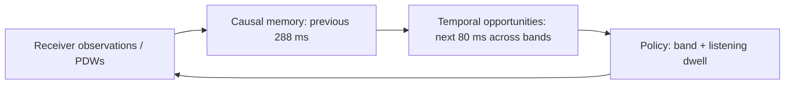

# Spectra Scheduler — Predictive Frequency-Time Allocation

[](https://github.com/Siwach777/spectra-scheduler/actions/workflows/ci.yml)

A passive, receive-only scheduling prototype for SIH26055. A receiver can listen
to only a small part of the spectrum at once; changing bands costs observation
time. The scheduler learns temporal opportunities from received detections and
chooses **both the next band and its listening dwell**.
[Project scope](docs/project_scope.md) defines the requirements.

## Approach

The selected model uses a causal temporal convolutional forecaster and a
retune-aware receding-horizon planner. The forecaster is the main learned
component; RL experiments are documented separately.



Runtime inputs contain **no emitter identity, true period/phase or future
observations**. Simulator truth and recording labels are used only for evaluation
and offline training targets. See the [architecture guide](docs/architecture.md)
and [editable architecture diagram](docs/assets/architecture.svg) for module boundaries.

## Results

The frozen selected policy was compared on **300 fresh simulated worlds**: 100
per behavior, with identical receiver settings and physical-time budgets for
every policy. Control dwell settings were selected on separate worlds. Capture
means exclude worlds with no emitted pulses.

| Scheduler | Agile capture | Spatial capture | Periodic capture |
| --- | ---: | ---: | ---: |
| Fixed sweep, 50-ms listening dwell | 11.10% | 11.17% | 10.87% |
| UCB | 11.17% | 17.59% | 18.91% |
| Thompson sampling | 9.80% | 23.62% | 30.07% |
| Markov Whittle | 9.62% | 25.24% | 32.86% |
| Non-neural phase planner | 27.57% | 45.85% | 64.15% |
| PUCT MPC | 11.14% | 11.17% | 8.26% |
| Gumbel MPC | 10.54% | 10.12% | 9.84% |
| **Selected timing scheduler** | **34.37%** | **51.56%** | **67.66%** |

All paired capture intervals against fixed sweep and both MPC controls are
positive. The periodic advantage over the phase planner is not established.
Spatial emitter discovery remains a weakness: **86.0% versus fixed sweep's
97.5%**. Coverage recovery experiments did not justify replacing the incumbent.
The [findings](docs/timing-model-findings.md) and
[public benchmark summary](reports/timing-selected-summary.json) include paired
intervals, discovery, selection rules and artifact provenance.

External TSRD PDW replay now exercises the frozen scheduler end to end. Correctly
handling unavailable measurement power and retaining raw pulse counts raised
capture from **9.85% to 43.49%** on 32 unseen validation recordings. Fixed sweep
captured 10.45% and rate-probe 51.66%; the corrected model discovered 93.35% of
emitters versus rate-probe's 84.39%. A training-only fine-tune did not improve
unseen results. TSRD is synthetic radar data, not real RF or hardware validation.
See the [external evidence](reports/timing-pdw-summary.json) and
[replay interface and results](docs/replay-interface.md#frozen-timing-scheduler-on-external-recordings).
The [replay CLI](docs/pulse-replay.md#run) runs the trained model and matched
controls on an individual recording.

With optional compiled planning and captured CUDA inference, warmed serial p99
was **0.464–0.532 ms** on the RTX 5070 Laptop GPU, with no 1-ms budget violations
over 5,986 decisions. This includes feedback processing, prediction, planning and
forecast creation; loading, warmup and receiver I/O are excluded. The accelerated
path preserves the original 300-world reports. See
[latency measurements](reports/timing-latency-summary.json).

## Demo

Set up the [CUDA environment](docs/runbook.md#1-set-up-the-environment), then run:

```bash
.venv-rl/bin/python web/server.py \
  --timing-model artifacts/timing-refine-v1/seed-0/best.pt
```

Open `http://127.0.0.1:8080/?preset=periodic-timing-video&view=dual`.
The browser shows both receivers, signal activity, historical detections,
pre-action opportunity forecasts, selected band/dwell and playback counters.
The selected seed-42 example captures 62/86 signals versus 13/86 for fixed sweep;
its 4.77× ratio describes that example. Results and JSON exports retain the full
run and model provenance. See the [GUI/API guide](web/README.md) and
[video instructions](web/video/README.md).


The selected local checkpoint is epoch 24, SHA-256
`f821a7672b5b378154caa89d981893b77a62ddc0119ea74053483aa611ca744f`.
Weights and downloaded recordings are not shipped in Git. Without installed
weights, the browser offers statistical demonstrations and marks learned policies
unavailable.

## Reproduce

Compare the timing policy with fixed sweeps, phase planning and saved MPC models:

```bash
.venv-rl/bin/python -m spectra_scheduler \
  --timing-model artifacts/timing-refine-v1/seed-0/best.pt \
  --mpc-model artifacts/mpc-physical-fresh-control/best.pt \
  --mpc-model artifacts/mpc-physical-gumbel-fresh/best.pt \
  --scenario periodic-scan --runs 100 --seed 48000 --workers 20 \
  --output reports/generated/timing-periodic.json
```

Use `frequency-agile` or `spatial-scan` for the other behaviors. Capture and
discovery are printed together. The [running manual](docs/runbook.md) covers
training, frozen control selection, external replay, native runtime builds,
serial latency and every CLI workflow. The command above compares existing models;
the full control-family table uses the frozen two-stage scan study in that manual.

For a reproducible statistical comparison without weights or CUDA:

```bash
uv sync --locked --extra dataset --extra learning --extra dev
.venv/bin/python -m spectra_scheduler --scenario mixed --runs 30 --seed 7
.venv/bin/python -m pytest -q
node web/check_frontend.mjs
```

CI runs correctness lint, CPU unit/HTTP checks, frontend regressions and a
deterministic smoke comparison. Neural experiments and their validation require
CUDA and run separately from CI.

## Documentation

- [Running manual](docs/runbook.md): environment, commands and troubleshooting.
- [Project status](docs/project-status.md): implemented features and remaining gaps.
- [Architecture](docs/architecture.md): interfaces and causal observation boundaries.
- [Submission slides](ppt/Spectra-Scheduler-SIH2026.pptx), [PDF](ppt/Spectra-Scheduler-SIH2026.pdf) and [rebuild instructions](ppt/README.md).
- [Evaluation contract](docs/evaluation-contract.md) and [report format](docs/report-format.md).
- [Timing findings](docs/timing-model-findings.md): selected model, controls and measured limitations.
- [Dataset workflow](docs/dataset-workflow.md), [pulse replay](docs/pulse-replay.md) and [replay policy interface](docs/replay-interface.md).
- [Related work](docs/related-work.md) and [implementation notes](docs/implementation-notes.md).
