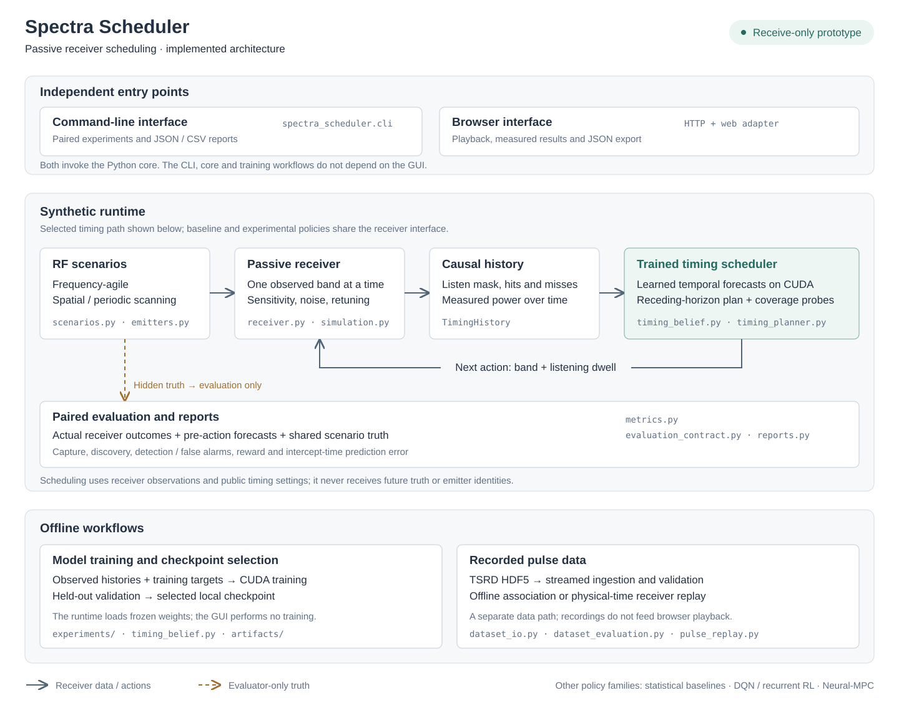

# Architecture

The diagram shows the selected learned timing scheduler and the surrounding
implemented workflows. It describes a software receiver model, rather than a
connection to RF hardware. All scheduling remains passive and receive-only.

## Runtime and observation boundary

[Scenarios and emitters](../src/spectra_scheduler/scenarios.py) generate seeded
transmission truth. The shared [simulation engine](../src/spectra_scheduler/simulation.py)
applies band selection, listening dwell and retune delay through the
[receiver model](../src/spectra_scheduler/receiver.py). Its public observations
contain measured detections and listening state, without emitter identity or
false-alarm labels.

[TimingHistory](../src/spectra_scheduler/timing_belief.py) keeps a bounded history
of listening masks, detection counts and measured power. The temporal forecaster
estimates future per-band capture counts from that history. The
[timing planner](../src/spectra_scheduler/timing_planner.py) accounts for retuning
and listening dwell, executes the first action of its plan, and replans after
receiver feedback. Coverage probes use public listening history.

Optional [compiled planning](../src/spectra_scheduler/planner_native.py) and
[captured CUDA inference](../src/spectra_scheduler/timing_runtime.py) reuse fixed
buffers and model launches. They preserve the selected policy and have been
checked against the original 300-world reports. Runtime options and serial-path
measurements are in the [runbook](runbook.md#accelerated-runtime-and-serial-latency).

Hidden truth reaches the receiver simulation and evaluator, but not the scheduler.
[Receiver metrics](../src/spectra_scheduler/metrics.py) and the
[evaluation contract](../src/spectra_scheduler/evaluation_contract.py) measure
actual outcomes against truth and forecasts submitted before the action.
Comparisons reuse the same seeded world and receiver settings for each policy.

## Entry points and offline workflows

| Area | Implementation | Relationship to the runtime |
| --- | --- | --- |
| CLI | [cli.py](../src/spectra_scheduler/cli.py), [comparison.py](../src/spectra_scheduler/comparison.py), [reports.py](../src/spectra_scheduler/reports.py) | Runs paired experiments and writes reports independently of the GUI. |
| Browser | [server.py](../web/server.py), [api.py](../web/api.py), [timing_backend.py](../web/timing_backend.py), [static assets](../web/static/) | Imports the core through a web-only adapter; exposes traces, playback, measurements and exports. |
| Timing training | [timing_refine.py](../src/spectra_scheduler/experiments/timing_refine.py) and [timing model](../src/spectra_scheduler/timing_belief.py) | Trains on CUDA and selects checkpoints using held-out validation. Runtime inference loads the selected local weights. |
| Pulse ingestion and association | [dataset_io.py](../src/spectra_scheduler/dataset_io.py), [dataset_evaluation.py](../src/spectra_scheduler/dataset_evaluation.py) | Streams TSRD HDF5 recordings and evaluates offline pulse association. |
| Physical-time replay | [pulse_replay.py](../src/spectra_scheduler/pulse_replay.py), [replay_env.py](../src/spectra_scheduler/replay_env.py), [replay_evaluation.py](../src/spectra_scheduler/replay_evaluation.py) | Provides a separate receiver environment and policy evaluation contract for recorded pulses. |

The GUI does not train models and currently plays synthetic comparisons, rather
than recorded-pulse replay. Core modules, CLI commands and training entry points
do not import the GUI. Training truth and labels remain separate from inference
inputs; recording labels are also excluded from delivered replay observations.

The [timing replay adapter](../src/spectra_scheduler/timing_replay.py) reconstructs
causal millisecond history from delivered PDWs and applies the frozen planner to
physical-time receiver actions. The completed external recording comparison
verifies this software boundary; it does not demonstrate real RF hardware.

Statistical schedulers, DQN/recurrent RL and Neural-MPC are alternative policy
families. They are not stages inside the selected timing scheduler. Their
implementation and experimental results are documented separately in the
[implementation notes](implementation-notes.md) and
[timing findings](timing-model-findings.md).

The diagram is an editable [SVG](assets/architecture.svg) with selectable text and
no external assets. Module names link the overview to implementation; detailed
requirements remain in [project scope](project_scope.md).
