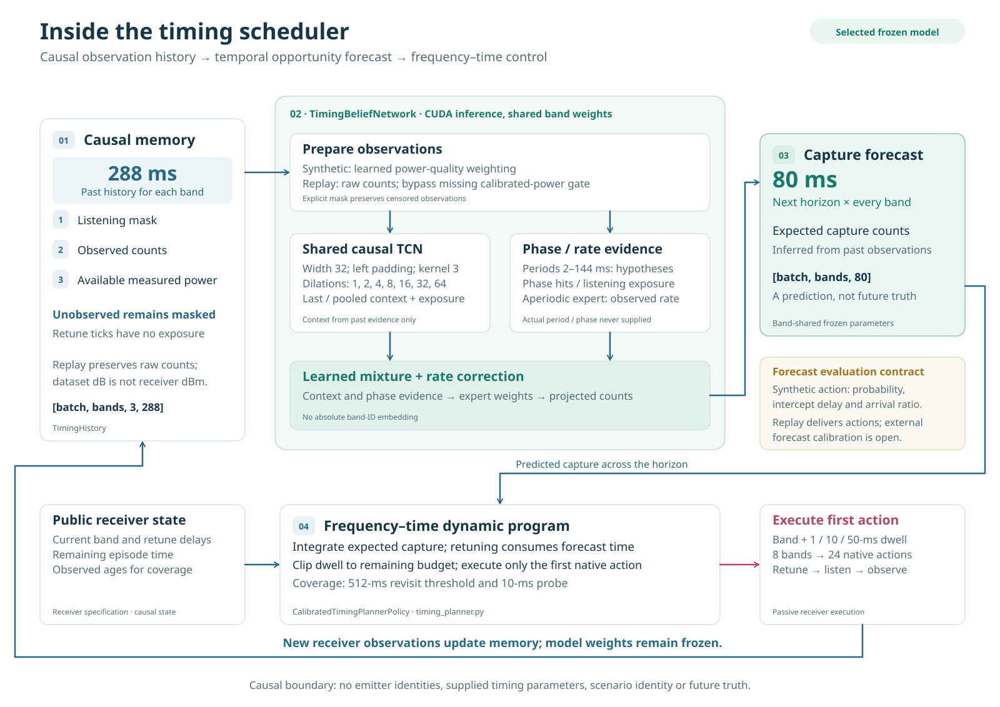

# Architecture

Spectra Scheduler has two passive receiver backends, one selected causal timing
policy, independent CLI/browser entry points, offline learning pipelines and a
shared evaluation contract. The diagrams describe implemented software. They do
not represent an SDR connection or real RF validation. Requirements remain in
[project scope](project_scope.md).

## Components and ownership

| Layer | Modules | Responsibility |
| --- | --- | --- |
| Synthetic console | [cli.py](../src/spectra_scheduler/cli.py), [timing_cli.py](../src/spectra_scheduler/timing_cli.py) | Select scenarios and policies; run paired comparisons; write JSON/CSV reports |
| Recording console | [replay_cli.py](../src/spectra_scheduler/replay_cli.py) | Run fixed sweep or frozen timing replay with matched sweep/RateProbe controls |
| Browser service | [server.py](../web/server.py), [api.py](../web/api.py), [timing_backend.py](../web/timing_backend.py) | Validate requests, invoke synthetic comparisons, serialize traces and provenance |
| Browser client | [web/static/](../web/static/) | Show receiver paths, detections, forecasts, playback counters, results and exports |
| Synthetic environment | [scenarios.py](../src/spectra_scheduler/scenarios.py), [emitters.py](../src/spectra_scheduler/emitters.py), [simulation.py](../src/spectra_scheduler/simulation.py), [receiver.py](../src/spectra_scheduler/receiver.py) | Generate seeded truth and execute passive receiver actions with modeled errors |
| PDW environment | [dataset_io.py](../src/spectra_scheduler/dataset_io.py), [pulse_replay.py](../src/spectra_scheduler/pulse_replay.py), [replay_env.py](../src/spectra_scheduler/replay_env.py) | Stream HDF5 pulses, execute physical-time passband/dwell actions, expose label-free feedback |
| Observation memory and model | [timing_belief.py](../src/spectra_scheduler/timing_belief.py) | Maintain causal history; infer future capture counts from masked observations |
| Selected planner | [timing_planner.py](../src/spectra_scheduler/timing_planner.py) | Integrate forecasts with retune/horizon constraints and causal coverage |
| Replay policy adapter | [timing_replay.py](../src/spectra_scheduler/timing_replay.py) | Convert delivered pulse timestamps into whole-ms history and map planner actions into replay indices |
| Evaluation | [evaluation_contract.py](../src/spectra_scheduler/evaluation_contract.py), [synthetic_evaluation.py](../src/spectra_scheduler/synthetic_evaluation.py), [replay_evaluation.py](../src/spectra_scheduler/replay_evaluation.py) | Join evaluator-only truth after decisions; score outcomes and pre-action forecasts |
| Benchmark/reporting | [policy_benchmark.py](../src/spectra_scheduler/policy_benchmark.py), [reports.py](../src/spectra_scheduler/reports.py), [experiments/](../src/spectra_scheduler/experiments/) | Freeze plans, run matched competitors, summarize paired metrics and retain provenance |

Core modules and training commands do not import the GUI. The browser adapter
imports the core. The browser computes a complete matched simulation before
playing it back; its timeline counters and displayed truth are inspection outputs,
not online hardware inputs. Its HTTP/export schema is documented separately in
[the GUI guide](../web/README.md).

## Receiver-to-policy contracts

The two backends preserve different native interfaces. Their adapters share the
selected forecaster and planning logic rather than pretending the observations
have identical units or features.

| Contract | Synthetic backend | PDW replay backend |
| --- | --- | --- |
| Clock | Discrete ticks; selected experiments explicitly use 1 ms per tick | Physical microseconds; timing adapter requires whole-ms alignment |
| Action | `SyntheticAction(band, dwell_steps)` | Integer `band * number_of_dwells + dwell_index`, or `Decision` with a forecast |
| Policy entry | `reset(bands)`, `choose_action(time_step)`, `observe(observation)` | `reset(specification, seed)`, `act(features)`, optional `observe_pulses(observation)` |
| Receiver-visible feedback | `Observation`: time, band, listening flag, counts and anonymous noisy measurements | Executed listening window, delivered PDWs, tuned center and overflow count |
| Amplitude units | Simulated dBm | Dataset dB; not converted into calibrated receiver dBm |
| Truth | Transmission/emitter records and detection labels stay with the evaluator | File-local emitter labels and all-spectrum arrivals stay with the evaluator |
| Forecast scoring | Selected-action capture probability, delay and ratio supplied before feedback | Current timing adapter returns actions; calibrated external forecasts are not established |

In both backends, requested dwell counts **listening time after retuning**. Changing
bands consumes retune time; staying on the current band does not. Actions are
clipped to the episode horizon. Comparisons charge the entire elapsed interval,
including missed opportunities while retuning, against the same receiver budget.

`ReplayEnv.step()` returns a `Transition` containing features, observable reward,
elapsed time, termination and physical-time discount. The runner calls
`TimingReplayPolicy.observe_pulses()` only after execution. That callback uses
`record_pdw_history()` to bin delivered arrival timestamps and listening masks,
then advances the policy history. Labels do not enter this callback.

Replay uses completed full-spectrum **stare** files. Recorded **scan** data remains
useful for ingestion/association studies, but its unobserved bands cannot provide
complete counterfactual schedule truth. Whole pulses must finish within their
listening windows; crossing a dwell boundary is rejected. See
[pulse replay](pulse-replay.md) and [the replay interface](replay-interface.md).

## Selected timing model

The selected checkpoint is `artifacts/timing-refine-v1/seed-0/best.pt`, epoch 24.
Weights are local artifacts, excluded from Git. Its architecture is:

| Stage | Representation or operation |
| --- | --- |
| Causal memory | `[batch, bands, 3, 288]`: listening mask, count and normalized measured power |
| Observation preparation | Weight synthetic counts using learned power-quality evidence; bypass that gate for missing calibrated replay power |
| Temporal context | Band-shared width-32 TCN; kernel size 3; left-padded dilations 1, 2, 4, 8, 16, 32, 64 |
| Timing evidence | Phase exposure/hit estimates for candidate periods 2–144 ticks, plus an aperiodic observed-rate expert |
| Learned mixture | Context and phase evidence weight experts; a learned correction scales the projected rate |
| Forecast output | `[batch, bands, 80]`: expected capture counts over the next 80 one-ms ticks |
| Action planning | Finite-horizon dynamic program over retune delays, native dwell choices and remaining episode time |
| Coverage | Observed-age checks; selected revisit threshold 512 ms and native 10-ms probe |

The timing hypotheses are generic candidates learned from observation evidence;
the model is never given the actual emitter period or phase. Parameters are shared
across bands without an absolute band-ID embedding. Unobserved history remains
masked rather than becoming negative evidence.

The planner executes only its first action and replans after feedback. Synthetic
forecasts are formed before action execution and scored on that action's actual
elapsed window. Public detection probability calibrates arrival-ratio forecasts
under an above-sensitivity assumption; hidden weak-signal arrivals are not inputs.

For replay, dataset amplitude is omitted from the synthetic power channel and
`power_available=False` prevents the learned sensitivity gate from suppressing
valid counts. Raw delivered counts are preserved. This corrects the original
transfer mismatch without changing the selected neural weights. PDW fine-tunes
have a distinct checkpoint domain/version; synthetic CLI/GUI loaders reject them.

## Offline learning and frozen evaluation

Training collectors record histories before actions and attach future targets
only in the offline path. Synthetic timing learning uses mixed collection policies,
followed by planner-state refinement with historical anchors. PDW adaptation uses
training-split recordings partitioned into separate fit and development sets.
Neither future targets nor emitter labels are supplied during runtime inference.

Neural optimization and neural experiment validation require CUDA. Independent
recordings/worlds use configurable CPU workers; GPU histories and losses use bounded
batches. Memory-mapped caches, staged transfers and reused workspaces bound memory.
The GUI loads frozen weights and does not train models.

Planner/control choices and checkpoints are selected on development inputs, then
frozen before reporting on separate worlds or recordings. Source/checkpoint hashes,
recording hashes, seed plans and receiver settings travel with the reports.
Synthetic and external replay results retain their distinct evaluation scopes.
The corrected frozen model remains selected; the PDW fine-tune and added acquisition
rule did not establish a suitable replacement.

The evaluator combines actual receiver outcomes with hidden truth and forecasts
submitted before feedback. It reports capture, discovery, acquisition/reacquisition,
receiver errors, reward/cost and prediction errors with censoring/coverage. Missing
metrics are explicit: replay has no modeled false alarms or externally calibrated
timing predictions. [The evaluation contract](evaluation-contract.md) defines
units, denominators and `null` behavior.

## Runtime acceleration and alternative policies

[planner_native.py](../src/spectra_scheduler/planner_native.py) loads an optional
C++17 implementation of the same dynamic program. [timing_runtime.py](../src/spectra_scheduler/timing_runtime.py)
uses CUDA graph capture to reuse model allocations/launches for frozen inference.
Fixed-shape buffers are reused; browser band-count changes recreate the relevant
capture. These are execution options, not new model architectures or objectives.

The accelerated synthetic path was checked against the original 300-world reports.
Warmed full serial p99 was 0.464–0.532 ms on the development GPU; cold startup,
receiver I/O and browser serialization are excluded. The replay CLI does not expose
these flags. Build, parity and latency commands are in
[the runbook](runbook.md#accelerated-runtime-and-serial-latency).

Statistical controls, phase planning, supervised hit models, DQN/recurrent PPO,
trajectory RL and Neural-MPC are alternative policies or research branches. They
share receiver/evaluation infrastructure; they are not stages inside the selected
forecaster. Offline HDBSCAN pulse association also remains a separate data workflow.
See [implementation notes](implementation-notes.md), [timing findings](timing-model-findings.md)
and [dataset workflow](dataset-workflow.md).

The [system SVG](assets/architecture.svg) and [model SVG](assets/timing-model.svg)
use editable vector shapes and selectable text, with no external image assets.
Blue connectors show data/forecasts, rose connectors show receiver actions,
amber dashed connectors show evaluator-only truth, and green dashed connectors
show frozen weights.
